# 🛡️ Fraud Monitor : Système de Détection de Fraude Transactionnelle

**Projet Data Science & Risque Financier** réalisé par **Sofiane El Morabit**.

---

## 📋 Contexte & Enjeux Business

Les institutions financières subissent des pertes massives dues aux transactions frauduleuses. Le défi technique majeur est le **déséquilibre extrême des classes** : les fraudes représentent seulement **0.17%** du volume total des transactions, rendant les règles statistiques classiques inefficaces.

**Objectifs du Projet :**
1.  **Minimiser le Risque Financier :** Détecter le maximum de fraudes réelles (Priorité au **Recall**).
2.  **Industrialisation :** Fournir un outil de scoring en temps réel pour les équipes d'audit via un Dashboard interactif.

---

## ⚙️ Architecture du Pipeline MLOps

Le projet suit un pipeline rigoureux pour garantir la robustesse du modèle face au déséquilibre des données.

```mermaid
graph LR
A[Données Brutes - CSV] --> B(Nettoyage & Prétraitement)
B --> C{Stratégie Déséquilibre}
C -->|SMOTE| D[Génération Données Synthétiques]
D --> E[Entraînement Modèle]
E --> F[Logistic Regression Pondérée]
F --> G[Dashboard Streamlit]
```

1. Exploration (EDA)
Analyse des distributions (Montants, Temps).
Mise en évidence du ratio critique (0.17% fraude vs 99.83% légitime).
Les analyses détaillées sont disponibles dans le dossier /notebooks.

---

2. Stratégie de Modélisation
Problème : Un modèle standard ignorerait la fraude pour maximiser sa précision globale (Accuracy Paradox).
Solution : Utilisation de SMOTE (Synthetic Minority Over-sampling Technique) pour rééquilibrer l'entraînement.
Algorithme : LogisticRegression avec le paramètre class_weight='balanced'.

---

📂 Structure du Projet : 

fraud-monitor/
├── app/
│   ├── main.py          # Interface Streamlit (Front-end)
│   └── fraud_model.pkl  # Modèle entraîné (Back-end)
├── data/                # Données brutes (Non incluses sur GitHub)
├── notebooks/           # Laboratoire de recherche (EDA, Tests)
├── src/                 # Scripts ETL et Entraînement
├── requirements.txt     # Dépendances
└── README.md            # Documentation
